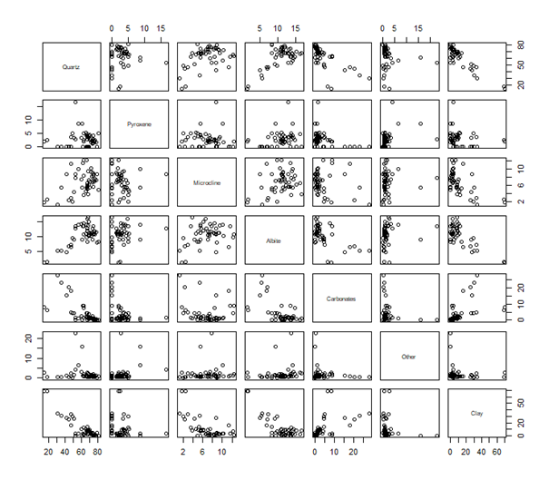
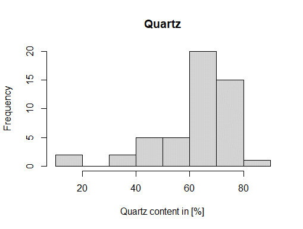
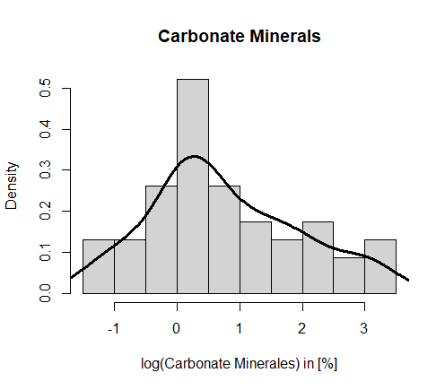
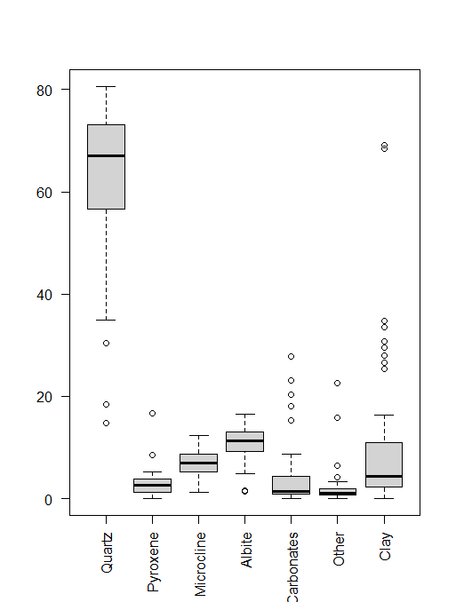
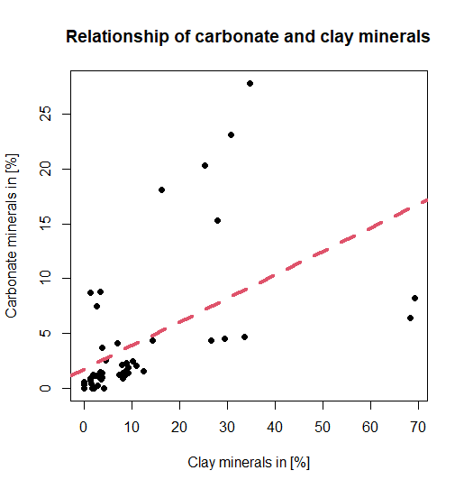
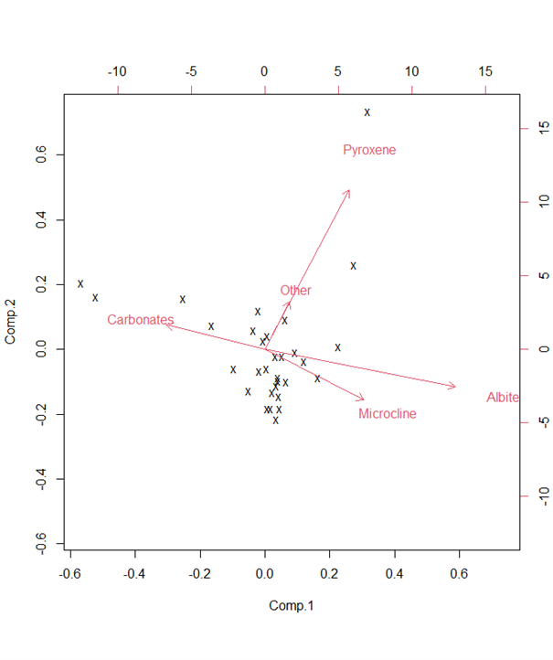
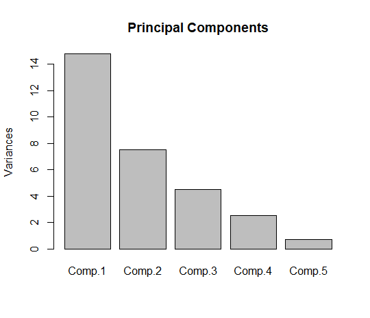

# Explore mineralogical data

This file shows part of my data exploration process of my mineralogical data. The data was derived by XRD analysis and is stored in a SQL database. Prior to storing it, the data was already cleaned. However, it contains zero’s as it is possible for some minerals to not occur in some samples.

The data has the following structure:
SampleId|Facies|Mineral1|Mineral2
--------|------|--------|--------
Sample1|Facies1|#Value|#Value|

### Workflow
First, I establish a connection with the database and load the XRD data formatted as a data frame into R. The data frame contains a lot of columns with zero or very low values (mineral contents). These accessory minerals are not the focus of my analysis, so they are aggregated to mineral groups. After transforming the data a statistical summary was calculated. Univariate, bivariate and multivariate analysis were used to explore the data.

A quick overview plot was used to get a general sense of the data.  
  

The histogram for the single mineral Quartz explores the frequency of its occurrence.  
  

The histogram and regression line of the carbonate minerals shows their density distribution.  
  
A boxplot allows the comparision between the mineral contents and their variances.  
  
This bivariate plot with regression line explores the relationship between the occurrence of two minerals.   
  
The biplot was created from a principal component analysis to showcase the relationships between several minerals.  
  
The screeplot shows how much variability each principal component covers.  
