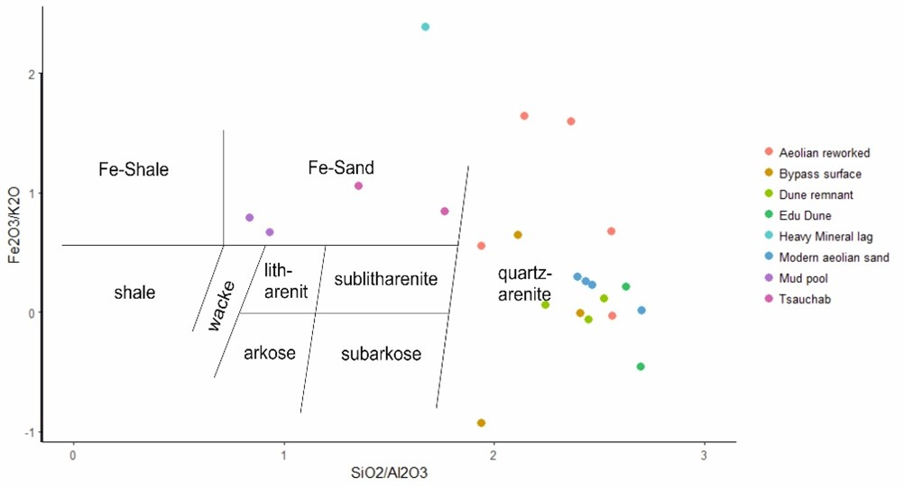
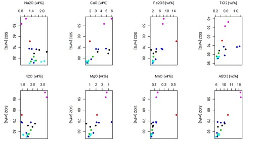
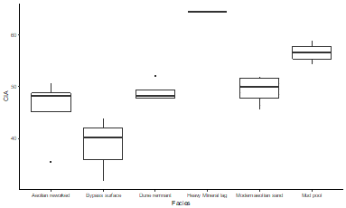
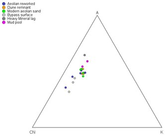
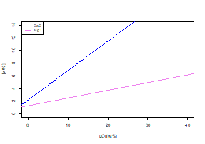
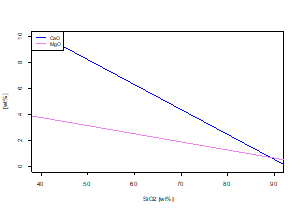

# Simple Plots

The Geochemistry file uses major element XRF analysis data. The data was already cleaned, prior to storing it in the database. 
The data has the following structure:
|SampleId|Facies|Element1|Element2|
|---|---|---|---|---|
|Sample1|Facies1|#Value|#Value|

First I get a quick overview and summary of the data. For most of the plots I group the data into different categories (facies) as it was a focus of my analysis to see the behavior of the different facies. Here you can see how the different plots looked:

Major element Sandstone Classification after Herron (1988): This was revised in Corel Draw to add the classification fields

Harker Diagrams  
  
CIA (Chemical alteration) Boxplot  
  
A-CN-K Weathering Plot  
  
LOI Regression Line  
  
SIO2 Regression Line  

